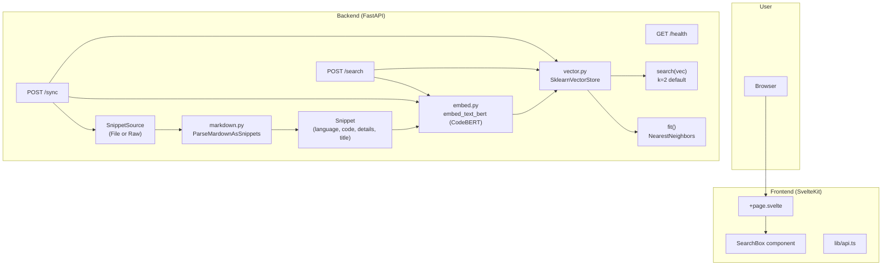
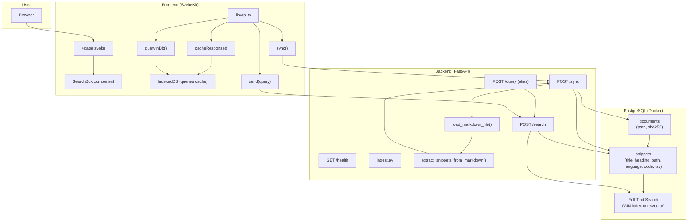

# pkb — Architecture Diagrams & Migration

This doc describes **two states** of the project: the **current branch** (in-memory + ML) and the **target state** (Postgres-first). Plus a comparison and how to migrate from current → Postgres.

---

## 1. Current branch (this state)

In this state the app uses **in-memory vector search** with sklearn and CodeBERT embeddings. There is **no PostgreSQL**; sync and search run entirely in process.

### Data flow (current)

- **Sync**
  1. `POST /sync` → `get_snipet_source()` (default: `SnippetSourceFile(app/gist.md)`).
  2. `snippet_source.get_snippets()` → reads file, `ParseMardownAsSnippets` parses markdown into `Snippet` (language, code, details, title).
  3. Each snippet is embedded with `embed_text_bert()` (CodeBERT), then `store.add(vec, snippet)`.
  4. `store.fit()` builds a **sklearn NearestNeighbors** index (cosine) in memory. No persistence across restarts.

- **Search**
  1. `POST /search` with `{ "term": "..." }` → embed term with `embed_text_bert()`, then `store.search(vec)` (default `k=2`).
  2. Returns `results: [{ score, metadata: Snippet }]`.

### Stack (current)

| Layer   | Tech |
|--------|------|
| Backend | FastAPI, sklearn, transformers/torch (CodeBERT) |
| Storage | In-memory only (`SklearnVectorStore`) |
| Search  | Cosine similarity on CodeBERT embeddings |
| Ingest  | `snippets.py` + `markdown.py` (ParseMardownAsSnippets) |

---

## 2. Target state (Postgres branch)

In the Postgres branch the app is **database-first**: markdown is ingested into PostgreSQL; search uses **full-text search** (tsvector + GIN). No ML required for core sync/search.

### Data flow (Postgres)

- **Sync**
  1. `POST /sync` → read markdown from `PKB_SOURCE_PATH` (default `app/gist.md`).
  2. `load_markdown_file()` + `extract_snippets_from_markdown()` (headings + fenced code blocks) → list of extracted snippets (title, heading_path, language, code, snippet_hash).
  3. Upsert **documents** (path, sha256); replace **snippets** for that document. Column `tsv` is a stored generated column: `to_tsvector('english', title || heading_path || language || code)` with GIN index.

- **Search**
  1. `POST /search` or `POST /query` with `{ "term": "...", "k": 5 }` → SQL `plainto_tsquery` + `ts_rank_cd`, limit `k`.
  2. Returns `results: [{ score, snippet: { id, title, heading_path, language, code, document_path } }]`.

### Stack (Postgres)

| Layer    | Tech |
|----------|------|
| Backend  | FastAPI, SQLAlchemy |
| Database | PostgreSQL 16 (Docker), Alembic |
| Search   | PostgreSQL FTS (tsvector + GIN) |
| Ingest   | `ingest.py` (no markdown.py section tree) |

---

## 3. Comparison

| Aspect | Current (this branch) | Target (Postgres branch) |
|--------|------------------------|---------------------------|
| **Storage** | In-memory only, lost on restart | Persistent in PostgreSQL |
| **Search** | Semantic (CodeBERT + sklearn cosine), `k=2` default | Lexical FTS (tsvector), configurable `k` (e.g. 5) |
| **Dependencies** | torch, transformers, sklearn | psycopg, SQLAlchemy, Alembic; no ML for core path |
| **Sync source** | `SnippetSourceFile(gist.md)` or Raw | Single markdown file via `PKB_SOURCE_PATH` |
| **Snippet model** | `Snippet` (language, code, details, title); from `markdown.py` section tree | Flat fields: title, heading_path, language, code, document_path; from `ingest.py` line-by-line parser |
| **API search body** | `{ "term": "..." }` | `{ "term": "...", "k": 5 }` |
| **Response shape** | `results: [{ score, metadata: Snippet }]` | `results: [{ score, snippet: SnippetOut }]` (includes document_path) |
| **Extra endpoints** | — | `GET /health` same; `POST /query` alias for `/search` |
| **Infra** | None | Docker Compose for Postgres, migrations |

---

## 4. Migration: current → Postgres

Goal: move from the current in-memory + ML setup to the Postgres-based design above.

### 4.1 Add Postgres and schema

- Add **Docker Compose** for Postgres (see `docker-compose.yml` on Postgres branch).
- Add **Alembic** and run migrations so you have:
  - `documents` (id, path, sha256, created_at, updated_at)
  - `snippets` (id, document_id, snippet_hash, title, heading_path, language, code, tsv computed, created_at), with GIN on `tsv` and FK to documents.

### 4.2 New backend modules (from Postgres branch)

- **`app/db.py`** — `DATABASE_URL`, engine, `SessionLocal`, `get_db()`.
- **`app/db_models.py`** — SQLAlchemy `Document` and `Snippet` (with `TSVECTOR` computed column).
- **`app/schemas.py`** — Pydantic: `SearchRequest` (term + k), `SnippetOut`, `SearchResult`, `ResponseSearch`, `ResponseSync`, `ResponseSyncBody`, etc.
- **`app/ingest.py`** — `load_markdown_file(path)`, `extract_snippets_from_markdown(raw)` (line-by-line headings + fenced blocks, no section tree).

### 4.3 Replace sync implementation

- Remove sync path that uses `SnippetSource` → `embed_text_bert` → `SklearnVectorStore`.
- In `main.py`, **sync** should:
  1. Use `PKB_SOURCE_PATH` (default `app/gist.md`).
  2. Call `load_markdown_file` and `extract_snippets_from_markdown`.
  3. In a DB transaction: upsert `Document`, delete existing snippets for that document, insert new `Snippet` rows (only non-empty code). Rely on DB for `tsv`.

(Optional) Keep `embed.py` / `vector.py` for a separate semantic-search feature later; core sync/search should not depend on them.

### 4.4 Replace search implementation

- Remove search path that uses `embed_text_bert` + `SklearnVectorStore`.
- **Search** should:
  1. Take `SearchRequest` with `term` and `k` (e.g. default 5, cap 50).
  2. Run the FTS SQL (`plainto_tsquery`, `ts_rank_cd`, `LIMIT k`).
  3. Return `ResponseSearch` with `results: [{ score, snippet: SnippetOut }]` (include `document_path` from join).

Add **`POST /query`** as an alias that calls the same search handler if you need compatibility with existing clients.

### 4.5 Align request/response with frontend

- Backend: accept JSON body `{ "term": "...", "k": 5 }` for `/search` and `/query`.
- If the frontend still uses `query`/`snippet_ids` or a different shape, either:
  - Update the frontend to use `results[].snippet` and `document_path`, or
  - Add a thin adapter in the backend that maps FTS results to the old response shape.

### 4.6 Cleanup (optional)

- Drop or refactor `get_store()` / `get_snipet_source()` and in-memory store from `main.py` once sync/search are fully on Postgres.
- Keep or archive `snippets.py` / `markdown.py` if you plan to reuse the section-based parser elsewhere; they are not used by the Postgres ingest pipeline.

---

## 5. Summary

- **Current**: In-memory CodeBERT + sklearn; sync parses gist markdown into snippets, embeds them, builds NearestNeighbors; search embeds the query and returns a few nearest snippets. No persistence.
- **Target**: Postgres stores documents and snippets; sync uses a simple markdown extractor and writes to DB; search uses PostgreSQL FTS. Optional ML can be re-added later without being in the core path.

Use the comparison table and migration steps above to move the project from the current state to the Postgres state step by step.
